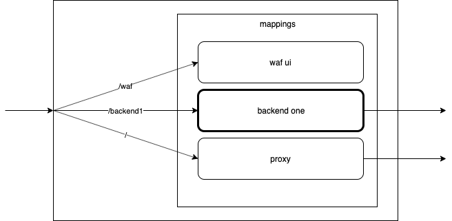
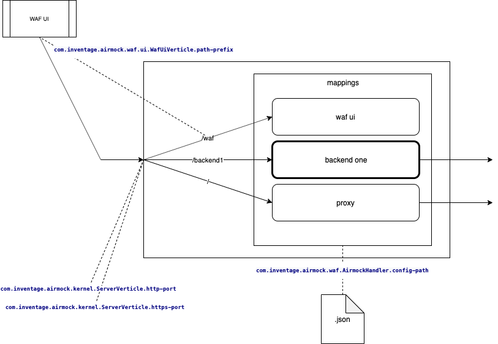
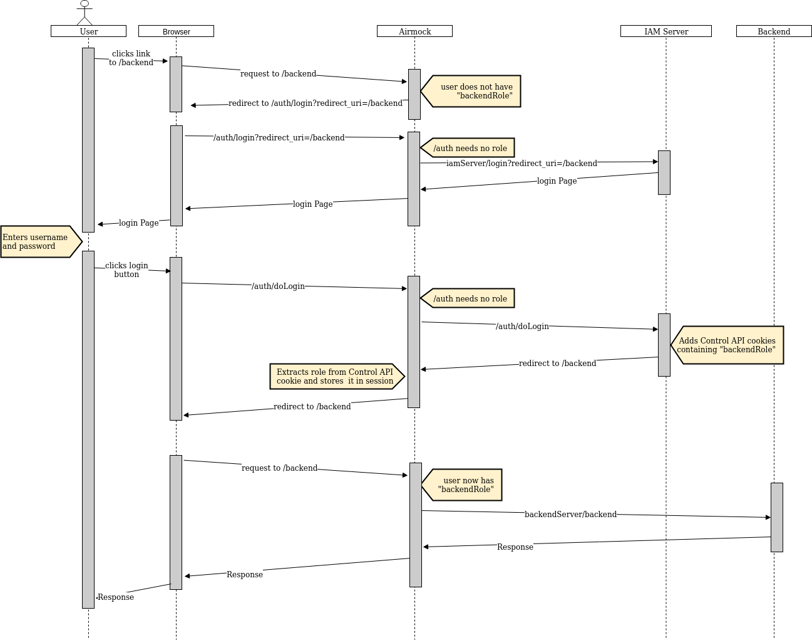

# Airmock

[](https://github.com/inventage/airmock/actions?query=workflow%3A%22Build+Pipeline%22)

Airmock is a mock implementation for web application firewalls. This means it intercepts requests to a web application, 
checks if the session the request is made in has the necessary roles and redirects to a URL for the user to log in if the roles are not there. 
If the required roles are there the request ist passed to the configured backend.

The primary use case for airmock is during application development. 

Incoming requests are dispatched according to their request prefix matching the context root of a mapping. The matching is done in the definition order.



The easiest way to use airmock is by starting it from the docker image.

A not yet released version (e.g. the latest build) can be taken from the [packages of the airmock](https://github.com/inventage/airmock/packages) repo.

```
docker run --rm -p10000:10000 -e com.inventage.airmock.waf.ui.WafUiVerticle.path-prefix=/waf docker.pkg.github.com/inventage/airmock/airmock:latest
```

The released versions can be taken from the [packages of the inventage/docker]() repo.

```
nyi
```

## Configuration

The configuration is done by environment variables and a JSON file for defining the mappings.



### Environment Variables

TODO

### Mappings

The mappings are defined by a mapping file in JSON syntax. It contains all mappings to be used.

The docker images comes with a default mapping file. It is located at `/opt/airmock/mapping/airmock.mappings.json` and the environment variable `com.inventage.airmock.waf.AirmockHandler.config-path` is set to this path. It contains the following entries:
```
{
  "mappings": [
    {
      "name": "waf ui",
      "contextRoot": "/waf"
    },
    {
      "name": "backend one",
      "contextRoot": "/backend1",
      "restrictedToRoles": ["aRole"],
      "authenticationFlow": "REDIRECT",
      "deniedAccessUrl": "https:/www.inventage.com",
      "backend": {
        "host": "localhost",
        "port": "10001"
      }
    },
    {
      "name": "proxy",
      "contextRoot": "/",
      "backend": {
        "protocol": "http",
        "host": "localhost",
        "port": "10001"
      }
    }
  ]
}
```

A mapping contains the following properties:
- **name**: A unique name for this mapping.
- **contextRoot**: The path this mapping is used for. A request matches a contextRoot if it starts with the contextRoot. The first matching mapping (in order of their appearance in the config file) wins.
- **restrictedToRoles**: The user must have on of these roles (comma separate them inside the square brackets if it's more than one) to be able to just pass through. The different authentication flow types handle it differently when the user does not have any. If this is empty, the request can always pass. This is ignored for TOKENEXCHANGE.
- **authenticationFlow**: The Type of authentication flow. Can be REDIRECT, ONESHOT, CODE_401, CODE_403 or `TOKENEXCHANGE`. These are explained below.
- **deniedAccessUrl**: The url to redirect to if the user does not have any of the required roles. For `TOKENEXCHANGE` this is the URL to send the token exchange request to. You can use environment variables here as ${exampleEnvVar}.
- **headers**: The headers to pass to the deniedAccessUrl. Used for ONESHOT.
- **backend**: The host port and protocol of the backend to redirect to. You can use environment variables here as ${exampleEnvVar}
- **config**: This is a container for additional configurations. So far this is used only for flow type `TOKENEXCHANGE`.
- **certificateUrl**: The URL to get the certificate to check an incoming JWT token against. Maybe check the well-known url of your server, if you don't know it. You can use environment variables here as ${exampleEnvVar}.
- **subjectIssuer**: //TODO
- **clientId**: The clientId to use in the token exchange call.
- **clientSecret**: The clientSecret to use in the token exchange request.

#### The different Authenticaton Flow Types
- **REDIRECT**: If the user does not have any of the roles configured in restrictedToRoles, airmock redirects to the deniedAccessUrl.
- **ONESHOT,**: If the user does not have any of the roles configured in restrictedToRoles, this makes a one shot request to the deniedAccessUrl. 
- **CODE_401**: Sends a 401 back if the user does not have one of the roles configured in restrictedToRoles. This is useful for mappings for backends that are not called from a browser that can display a login screen (for example the server of a SPA). 
- **CODE_403**: Sends a 403 back if the user does not have one of the roles configured in restrictedToRoles. This is useful for mappings for backends that are not called from a browser that can display a login screen (for example the server of a SPA).
- **TOKENEXCHANGE**: This expects a either a JWT in the Cookie "jwt" or a SAML Assertion in the Authorization header. If The JWT is not there or not valid, Airmock makes a token exchange reequest to the accessDeniedUrl and uses the resulting JWT. It also sets that JWT as a cookie so that it is available on subsequent calls.

## Docker login for GitHub Packages

For pulling docker images from any GitHub Packages Repository an authentication with a GithHub personal access token is mandatory. This can be created in the [settings of your GitHub account](https://github.com/settings/profile) (see [Creating a personal access token for the command line](https://help.github.com/en/github/authenticating-to-github/creating-a-personal-access-token-for-the-command-line)). Please note that the following scopes must be selected for such a token:
- repo
- read:packages

The authentication is done by:

```
docker login -u <GITHUB-USERNAME> -p <PERSONAL-ACCESS-TOKEN> docker.pkg.github.com
```

## Typical sequence
Here is a typical sequencen for a user trying to access a backend server and then logging in with username and password first. The relevant part of the config for it looks like this:

```
{
  "mappings": [
    {
      "name": "backend",
      "contextRoot": "/backend",
      "restrictedToRoles": ["backendRole"],
      "authenticationFlow": "REDIRECT",
      "deniedAccessUrl": "/auth/login?redirect_uri=",
      "backend": {
        "host": "backendServer",
        "port": "10001"
      }
    },
    {
      "name": "iam",
      "contextRoot": "/auth",
      "authenticationFlow": "REDIRECT",
      "backend": {
        "host": "localhost",
        "port": "10001"
      }
    }
  ]
}
```


Please note that the details of the actual login can vary a lot depending on IAM Server and login method such as different kinds of second factor authorization.

## Setting roles in Airmock (Control API)

To set a role for a user in Airmock, the IAM Server must use the ADD_CREDENTIALS command of the Airlock Control API. 
The Airlock IAM Server does this automatically since it is its way to communicate with the Airlock WAF. 
We also developed an extension for Keycloak that can communicate using this API. That extension also enables Keycloak to communicate with an actual Airlock WAF.